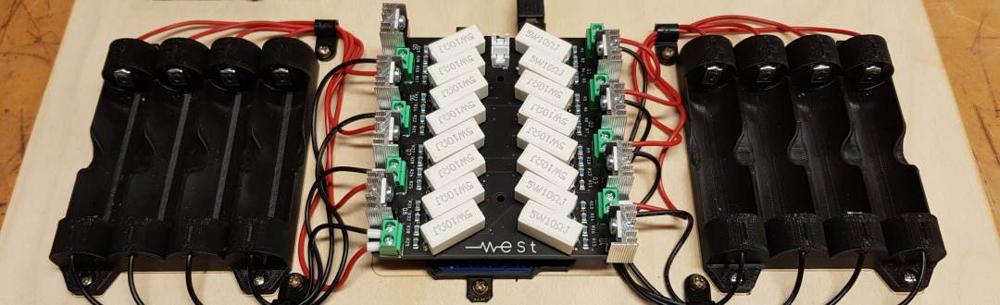

# Battery Tester

Introduction: This device is designed to test the capacity of 18650 li-on cells. The curcit discharges each cell at a constant rate and clocks the time it takes untill the cells is discharged. The cells are monitord and data is stored and cent for each cells preformance. 

The reason of doing this is to later match cells with simular preformance and combne them into battery pacs. Your battery pack is only as good as your worst cell. 

Purpous:
I love making things that move. However the power supply quiqly becomes restricting. This makes good batteries a must have. However there is hard to find a good power source on a budget. After fallowing the EV-comunity for a while I got a understanding of making battery packs on my own from thrown out battey pacs. Some of the best types of a batteries are the li-no,

