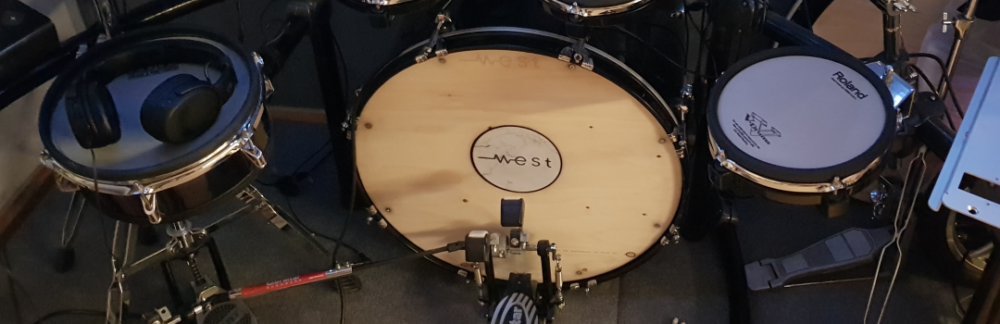
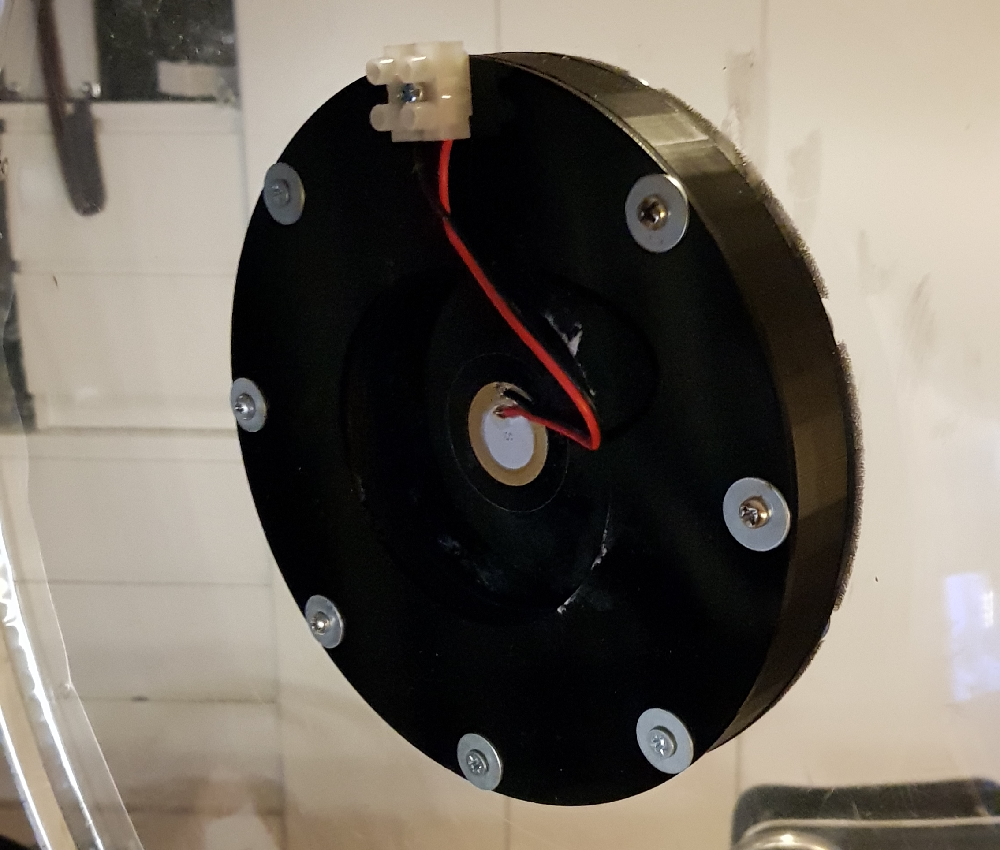
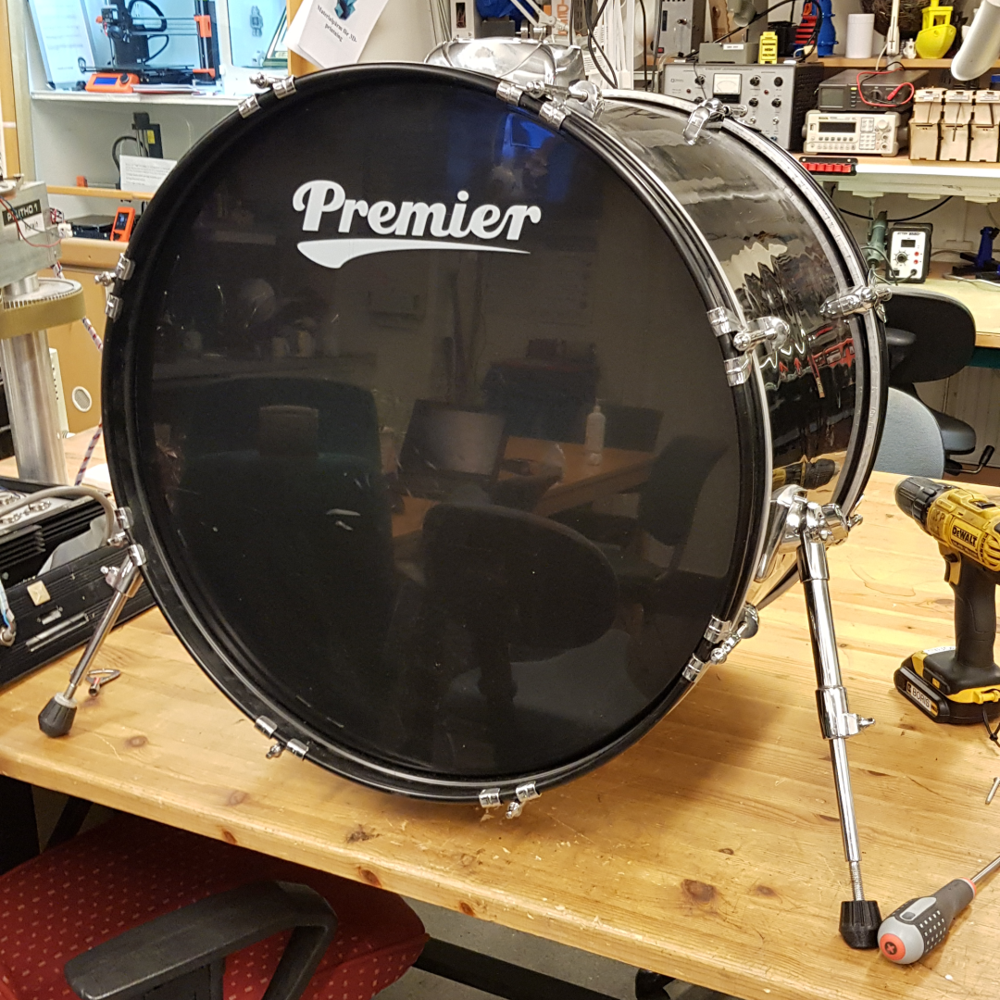
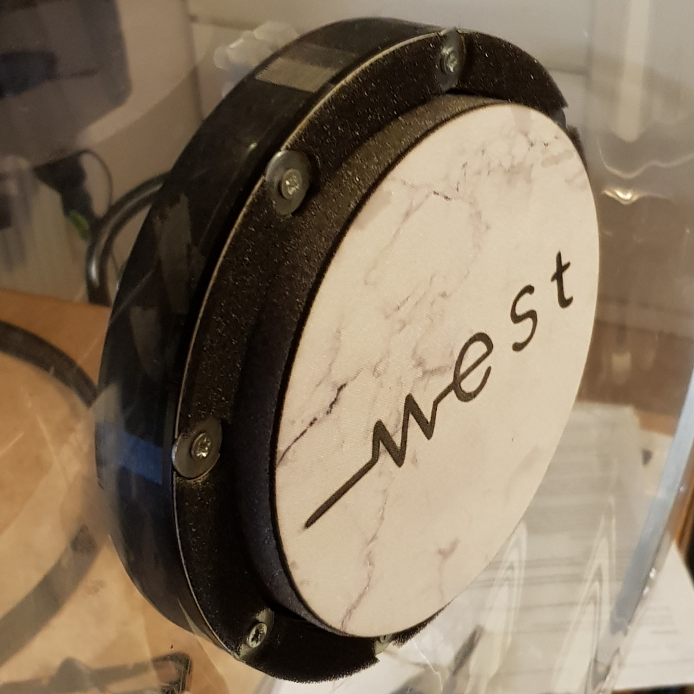

# E-Drums
A hobby of mine is playing drums. However acoustic drums are pretty much impossible to have in any kind of apartment without driving your neighbors mad. This leaves you with rather few options. Digital drums will have to do. However, I want to take it a bit further than just your average e-drum kit.

 After having done some research I realized that the internals of the drums themself are really simple. One or two piezo elements are mounted to the drum frame. The magic happens in the drum module itself. After realizing this I figured that it wouldn’t be too hard to convert a cheap second-hand acoustic drumkit into the most authentic feeling digital kit known to man.

## Bass Drum

