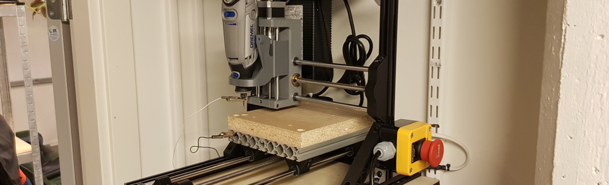

# PCB CNC

A lot of my projects include a fair chair of prototyping. One of the more time-consuming prats of prototyping is building the experiment boards and connecting everything. To reduce this time I decided to make a desktop-sized CNC constructed specifically to mill experimental PCB’s. 

Most of the materials used to build this is stuff I had lying around from previous projects. After having built my first 3D printers alongside some other CNC-related projects I know my way around the hardware and the software needed to make this work. 
