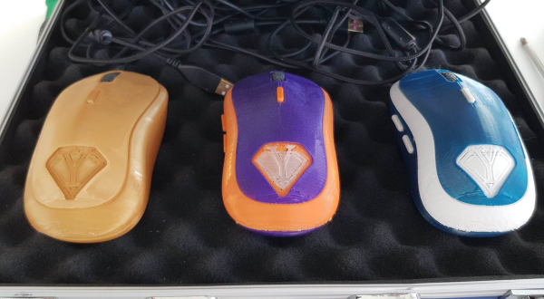

# RazMouse
One course that deserves to be highlighted is the one I took in embedded circuit design. Together with two other classmates, we designed a gaming mouse from the ground up. This involved several fields in engineering and served as an excellent opportunity to work in a team to develop a product from scratch. Beginning with the electronics design in KiCad we learned how to correctly implement a microprocessor on a circuit board. How to take high-speed transmission lines, decoupling, and oscillator caps into account. Expanding on the basic features of a computer mouse, we added a lot of extra features. Such as haptic feedback, RGB lights, a custom case, and side and top buttons with the capability to control the features of the mouse. The software for the mouse where done in rust lang.

